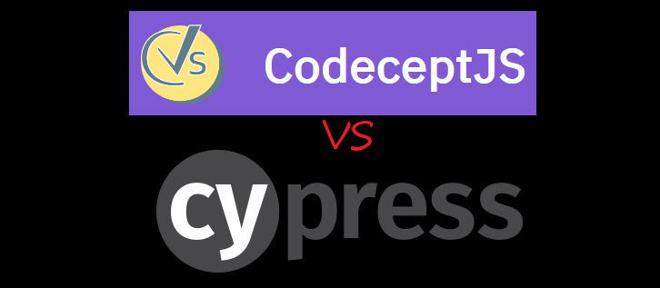

# Testing testers: CodeceptJS + Playwright vs CypressIO

## Why Test

If you are just writing short, quick, throwaway code, you don't need a fancy testing system.  Make a quick demo or 3, put the expected output in your README, & move on.  You're just going to torture your future self & others in having to download a bunch of testing software, and contribute to global warming for no good reason.

But if you want to work on your own code later, have others to help out, or want to sell or support your hard work, you need more structured testing.  The investment will pay off in the long run.  There are reasons why it is called "Quality Assurance".

## Testing Types Terminology

There are [many](https://www.pcloudy.com/functional-testing-vs-non-functional-testing/) [many](https://www.testingxperts.com/blog/types-of-software-testing) types of testing!  The first stages of testing is grouped under a "functional" where you verify the code's output.  (Though there might be UX testing on mockps before the programmer starts.)

### Basic Functional Testing Levels

+ [Unit](https://dzone.com/articles/unit-testing-guidelines-what-to-test-and-what-not) (atomic low level)
+ [Integration](https://www.techrepublic.com/article/integration-testing-will-show-you-how-well-your-modules-get-along/) (mid level checking process flow, [most important](https://kentcdodds.com/blog/write-tests) to some)
+ [End-to-End](https://www.ranorex.com/blog/10-best-practices-test-automation-9-plan-e2e-testing/) (higher level, on deployed code or developer sandbox)

There might be slight overlaps between these levels.  But there is greater cross-over with other types of testing.

### Other QA Testing

+ [Component](http://datasift.github.io/storyplayer/v2/learn/test-your-code/why-component-testing.html) (mid level, isolated using dummy data to check functionality)
+ [Regression](https://www.seguetech.com/regression-testing-quality-assurance/) (see if new code degrades rest of app: mid to E2E levels)
+ [Sanity](http://tryqa.com/what-is-sanity-testing/) (focused regression subset, integration-level crossover)
+ [Smoke](https://www.edureka.co/blog/what-is-smoke-testing/) (quickly ensure basic functions are working before builds)
+ [Load](https://www.dotcom-tools.com/load-testing-performance-tools.aspx) &/or Stress (can your service handle a title wave of customers?)
+ [Security/Vulnerablity](https://blog.cobalt.io/a-managers-guide-to-selecting-the-best-testing-approach-for-your-application-security-needs-2a31437bcfd8) (sometimes overlooked until too late...)
+ [Session+Based+Exploratory](https://www.testim.io/blog/exploratory-testing/) (~1 hour focused on a single goal)
+ [Exploratory](https://www.atlassian.com/continuous-delivery/software-testing/exploratory-testing) (1-2 hours of manual digging for non-obvious errors)
+ [Usablity](https://www.usability.gov/how-to-and-tools/methods/usability-testing.html) (UX works for everyone, including less-abled)
+ [System](https://www.guru99.com/system-testing.html) validating everything above at a high level
+ Beta/[User Acceptance](https://usersnap.com/blog/user-acceptance-testing-right/)  (actual target users verify if it fits their needs in normal scenarios or automated to check off shareholder's requirements)

Wow, that is quite a bit to digest!  Follow the links if you want to dig deeper; each type is worth a full article.

 
<small>Obligatory semi-related Unsplash image, credit [Science in HD](https://unsplash.com/@scienceinhd)</small>

## Why worry about End-to-End testing?

I want to focus on is automating some End-to-End (E2E) testing.  This higher level may be ran as Sanity or Smoke or Regression testing before code is merged into the 'master' code base.  It can be part of User Acceptance, maybe even usability or even Security testing.. Plus E2E can be difficult and expensive to run.  Since there are so many parts of a code base running together, there is more opportunities something can go wrong, so testing costs can be higher.

But there are many rewards to automated End-to-End testing:

 * finding bugs that lower-level tests might not
 * help document what had been discovered by manual testing
 * save money and time
 
 
## End-to-End Testing in JavaScript

Since I already know JavaScript, I looked around to see if there were any frameworks or toolkits to conduct in-browser automated testing.  Handy that JS runs both inside the browser and as a server/desktop runtime.

Looking around, it seemed  [Cypress](https://www.cypress.io/) is one of the top contenders.  But I also wanted to check out the new 'web automation' tool: [Playwright](https://github.com/microsoft/playwright#playwright).  It allows the three major browsers on the three major operating systems run scripts via JavaScript.  While the Playwright GitHub repo is only a few months old (started 2019-11-10)  many of the founding devs worked on a similar automated browser, Puppeteer, so there is already years of experience behind that young project.  Searching on YouTube for videos for Playwright, I found that  [CodeceptJS](https://codecept.io/helpers/Playwright/#configuration)) test runner works very nicely together.

## Quick Cypress vs CodeceptJS+Playwright Comparison

I wanted to try them both out on a.... not simple website, so I chose Facebook.  :)  FB is familiar to many, and because of its many features FB does not run butter smooth all the time.  You could consider it 'legacy', which is dev-talk for several dev teams evolved the code over a long time.  So the code is not consistent in technique or optimizations. (eg inconstant selectors)

My example code is short, only 1 E2E test with the following steps:

1. Login via email, password, button click
2. Click first `Create Event` button
3. Click `Create Private Event` button
4. Fill in first field
5. `pause`, to halt the test and enter interactive mode

My code for both testing frameworks is here:
https://github.com/tomByrer/codecept-playwright-vs-cypressio-fb

### CypressIO

#### Advantages

+ Parallelized runner to complete tests faster
+ [Built-in GUI](https://docs.cypress.io/guides/overview/why-cypress.html#Writing-tests) to see steps right next to the running browser
+ [Commercial product](https://www.cypress.io/pricing) with a generous free tier & free for OSS.  Cash flow = good support
+ Mature codebase
+ [Fancy dashbord](https://www.cypress.io/dashboard) brings me fond memories of BrowserStack
+ [Bundled Tools](https://docs.cypress.io/guides/references/bundled-tools.html): popular testing programs like Mocha, Chai, Chai-jQuery, Sinon.JS, minimatch, MomentJS, etc.

#### Disadvantages

- [Listed Trade-offs](https://docs.cypress.io/guides/references/trade-offs.html#Permanent-trade-offs-1)
  - not a general purpose automation tool
  - NOT a true 'headless browser', not good for: web-scraping,  scripting 3rd party sites, performance testing, etc
  - always runs inside of a browser (which can also be a pro)
  - no multiple browser tabs.
  - can't drive two browsers at the same time
  - `same-origin` only
- worse than CodeceptJS in a few areas
  - runs in Electron, using a slightly older version of Chromium.  Firefox support is in Beta, & I don't see any Safari or mobile support
  - cold-starts seems slower on my machine (i5, NVMe SSD, 32Gb RAM, Win10)
  - selecting elements without id or non-dynamic class name is more difficult, so building my short test took longer than CodeceptJS

### CodeceptJS with Playwright

#### Advantages

  + totally free
  + [consulting help](https://sdclabs.com/codeceptjs) is available
  + around for years, Codecept-PHP & Puppeter were prior versions
  + CodeceptJS can [use **many** browser configs](https://github.com/Codeception/CodeceptJS#supercharged-e2e-testing): Puppeteer, Playwright (nearly full Firefox & Safari compatibility on all desktops), WebDriver via webdriverio or Protractor, TestCafe, Nightmare, and Appium or Detox for mobile tests; very flexible
  + Playwright keeps "browsers are as pure as they can be", so tests are accurately reflecting real users' browsers
  + better for uses other than 'in-house e2e testing
    + good choice for 3rd party site testing, web scraping
  + I prefer Codecept's more terse syntax of including selectors with actions,
  + Codecept's selecting via text (eg button labels) made building tests quick and fun
  + fast cold-starts

#### Disadvantages vs Cypress

- CodeceptJS has a [smaller dev team](https://github.com/Codeception/CodeceptJS/graphs/contributors); basically only one guy with a second helping.  Main dev is productive though; [docs are frequently updated](https://github.com/codecept-js/website/graphs/commit-activity) & he is constantly adding something somewhere
- CodeceptJS' GUI is [very young](https://github.com/codecept-js/ui), though the text-only approach is more than fine, since you can `.pause()` and try new test commands via CLI
- seems to run slower than Cypress (in the little usage I have), I had to add more longer `wait`s to get the page to load enough for next stage
- neither packages are as popular; fewer stars on Github, less training videos around, fewer blog posts, though they both are *popular enough* to get going and find support

## Conclusion: Cypress or CodeceptJS?

My gut feeling (as of March 2020) is to go with CodeceptJS with Playwright; they both are flexible, and a strong team together.  Using Playwright to cover Chrome & their siblings plus FIrefox plus Webkit is nice.  Plus, if you need mobile testing, or get tired of Playwright for some reason,  CodeceptJS makes it convenient to switch browser platforms. CodeceptJS feels feature rich, and is still growing.  Also, reducing the need to bother the developers to add testing-only classes or data-attributes could reduce costs.  I suspect (with my limited research) that Codecept can be used outside of End-to-End testing.

However, if you have a more junior test team, prefer to use a product backed by a wider commercial venture, &/or like a more mature GUI, then CypressIO is the way to go.  Even though tests may take a bit longer to build, it feels Cypress is slightly but consistently faster and smoother to actually run the tests after the cold start. Their GUI+browser angle relieved some of the testing stress.  Cypress is a solid choice as well.

*Aside*: if you get tired of Codecept, you *could* use Playwright directly, but you'll have to rewrite the tests.   But I feel Codecept makes life more tester-friendly, so it is worth the extra overhead.

I hope you enjoyed this overview!  Please add comments & suggestions below.
